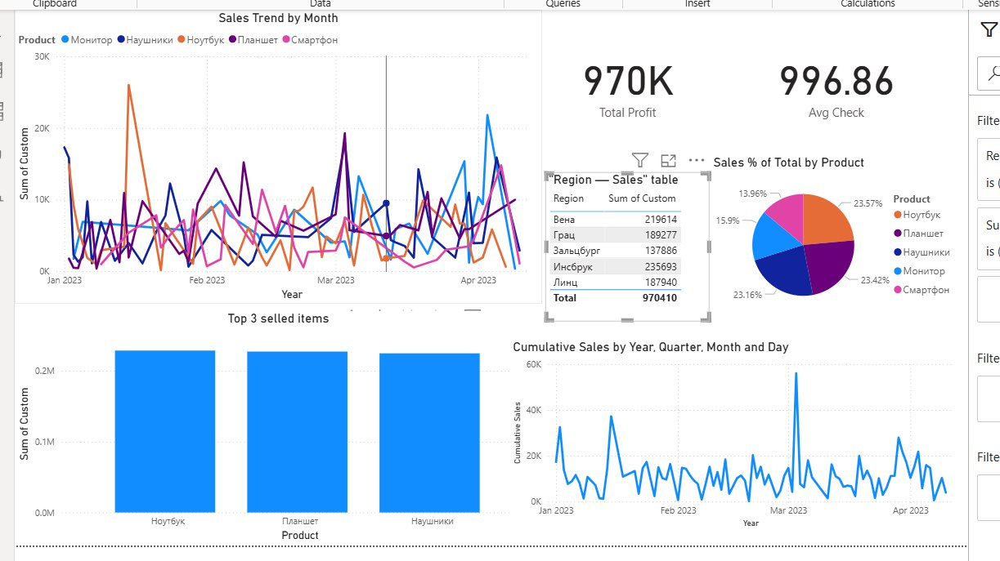

# Regional Sales Dashboard (Power BI)

This project is an interactive dashboard for analyzing regional sales performance.
📊 Analysts with the Innsbruck role can only see sales data for that region (implemented through Row-Level Security in Power BI). Managers, on the other hand, have access to all regions.

## How to Open
1. Download `visualization_of_sales.pbix`.
2. Open it in Power BI Desktop.
3. Log in as **Analyst** → you will only see data for your assigned region.

## Screenshots

## Technologies
- Power BI  
- Row-Level Security (RLS)  
- SQL (for data preparation)  
